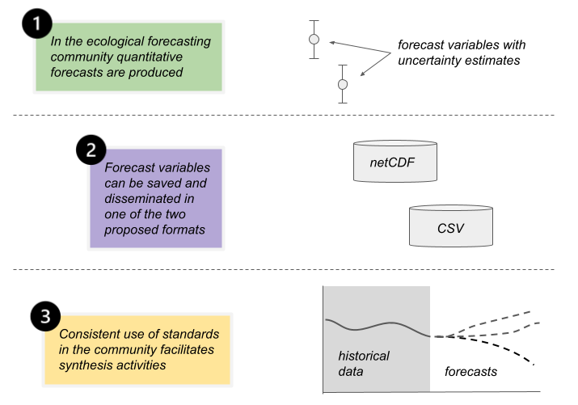
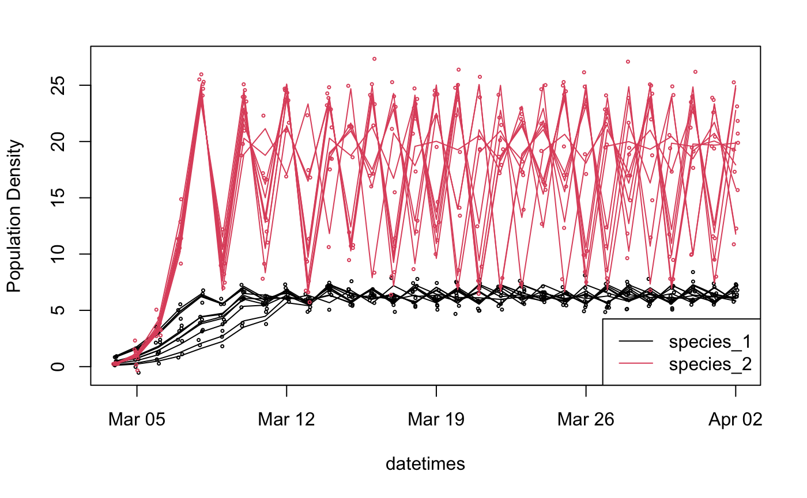

# INTRODUCTION
Ecological forecasting is an important and rapidly growing research area that aims to simultaneously accelerate ecological research and provide decision-relevant information to stakeholders [@dietze_ecological_2017; @dietze_forecasting_2019; @bradford_ecological_2020; @lewis_power_2023]. In this time of rapid environmental change, forecasts respond to the imperative need to provide society with the best-available information to support environmental decision making (Clark 2001). The nonstationary nature of many environmental changes highlights the need for forecasts as traditional management approaches rely on historical norms that may no longer be relevant (Milly et al. 2008, Rollinson et al. 2021). Iterative forecasts, which can be tested and updated on decision-relevant timescales, are particularly useful and are now possible in many domains through increases in data volume, openness, and speed (i.e., reduced latency) (Dietze et al. 2018). This process of iterative learning serves to accelerate basic research, while comparative analyses across forecasts allow researchers to tackle grand challenge questions about the predictability of ecological processes and the transferability of ecological understanding to new contexts (Lewis et al. 2023).

Numerous definitions exist across different disciplines, as well as within the discipline of ecology, for what constitutes a forecast. Within this document we will use the term “ecological forecast” to encompass both predictions of ecosystems and the services they provide based on our current understanding and projections made conditional on future scenarios or decision alternatives (Dietze 2017a). Within our definition forecasts also possess three key features. First, forecasts have to be made for quantities that were genuinely unobservable at the time the forecast was issued. Forecasts are typically made into a future time that has not been observed yet, but predictions to new spatial locations, state variables, or species (i.e., phylogenetic predictions) are also considered forecasts under this definition. We generally do not consider hindcasts, cross-validation, or any other post-hoc modeling to constitute a forecast, although it is worth noting that many forecast workflows are also used to produce “nowcasts” and reanalysis products (Baatz et al. 2021, Dokoohaki et al. 2021). Second, forecasts need to be quantitative and specific, which makes them falsifiable. Although qualitative input from experts and users, including indigenous knowledge, can be valuable for the construction and interpretation of forecasts, qualitative prognostications about the future do not constitute forecasts (Tetlock and Gardner 2015). The final defining feature of ecological forecasts is that they include a robust and formal accounting of the uncertainties in predictions and projections, and thus they tend to be probabilistic in nature (Clark 2001).

Because ecological forecasting is a relatively new research area (Lewis et al. 2021), how practitioners develop, implement, operationalize, and archive forecasts can vary greatly. Up to this point in time almost every new ecological forecast system brought online has been unique, with its own implementation of solutions to common forecasting problems such as automation, data processing, and uncertainty propagation. Although innovation is critical for an emerging field, the current approach of “boutique” solutions comes at the cost of substantial redundancy in efforts. The cost of such redundancy is nontrivial – in bringing a forecast “online” as an automated workflow, the bar for reproducibility is considerably higher than for other types of modeling and analysis, and thus requires a substantial amount of specialized technical knowledge. This further acts as a barrier to entry for researchers wanting to work in this area. And even beyond the steep learning curve, simply maintaining unique, independent workflows incurs a substantial ongoing cost, one that can be prohibitive for many government agencies, academic institutions, and nongovernmental organizations (NGOs), thus acting both as a further barrier to operationalization and putting operational forecasts continually at risk of being terminated (Brown 2019).

In disciplines where forecasting is a more established part of the field, such as meteorology, these workflow and operationalization costs are often carried by centralized agencies (e.g., government weather services) that have invested in highly-specialized cyberinfrastructure capable of handling data volumes in excess of 10TB/day (Hamill et al. 2013, Hersbach et al. 2020). The societal relevance of weather predictions (e.g., to address flood risks, aviation safety, or military purposes) have justified government funding for many decades, thereby creating a solid foundation for the field of numerical weather prediction (which is the origin of many of the mathematics and theoretical concepts that are now an intrinsic part of ecological forecasting’s vocabulary and toolbox) (Shuman 1989). However, the biological diversity that is innate to ecology as a field prevents such monolithic approaches – ecology does not have one big forecasting problem with an agreed upon set of governing equations (e.g., weather) but rather has a large number of “medium-sized” problems (i.e., large enough in size to be challenging, but not so large as to justify centralized infrastructure) that rely upon a diverse set of different models and data streams. For example, ecological forecast span terrestrial, freshwater, and marine systems using a wide range of methods (statistical models, machine learning, process-based models) to make predictions across a range of biological scales and processes (ecophysiology, individuals [e.g., animal movement], populations, communities, ecosystems, biogeochemical rates). In the face of such challenges, an important framework that has emerged is the idea of community cyberinfrastructure that is decentralized but scalable to new problems (Fer et al. 2021). 

At the core, community cyberinfrastructure starts first with agreed upon community standards and conventions (variable names, data structures, file formats, archiving, etc.). Such conventions form the basis for interoperability, which allows the development of shared, reusable, and scalable tools. Community conventions are especially important for ecological forecasts: the output files from the forecasts themselves; the metadata about these forecasts as the models used to produce them; and the archiving of output files, metadata, models, and workflows. Such a convention would not just benefit interoperability of tools and analyses but would also improve dissemination by allowing end users of different forecasts to work with consistent, predictable data. This would further support the development of tools that facilitate dissemination (e.g., standards and conventions around Application Programming Interfaces [APIs], visualization, and decision support) and, more broadly, signal the maturation of the field in a way that the status quo (i.e., every forecast is different) does not. 

Independent of infrastructure, community conventions also benefit the community scientifically. From the standpoint of data analysis, synthesizing data that are not standardized and interoperable is time-consuming, error-prone, and not scalable. At the same time, from the standpoint of data production, adopting community standards after data have already been generated is also challenging, especially for long-running projects producing high volumes of data. As a relatively new research area, ecological forecasting has the opportunity to adopt community conventions now, while the community is relatively small and time series are relatively short. This would not only facilitate independent validation of individual forecasts, but also larger efforts at cross-forecast synthesis (Figure 1) and the testing of grand challenge questions about the patterns of predictability across ecological systems (Dietze 2017b). It would also allow the community to generate multi-model forecasts and to run forecast model intercomparisons, such as the National Ecological Observatory Network (NEON) Ecological Forecasting Challenge organized by the Ecological Forecasting Initiative’s Research Coordination Network (EFI-RCN) (Thomas et al. 2021). Specifically, within model intercomparison projects having community conventions makes it easier to communicate protocols to participants, to verify that submissions from participating teams are correct and complete, and to facilitate analyses by ensuring contributions are interoperable. These benefits can also extend across communities, if one research community uses outputs from one model intercomparison project as inputs into another. For example, many long-term ecological forecasts are driven by the ensemble climate outputs from the Coupled Model Intercomparison Project (CMIP), which itself relies on emissions scenarios derived from socioeconomic models (O’Neill et al. 2016, Arora et al. 2020). Overall, community conventions play a key role in making ecological forecasts FAIR (Findable, Accessible, Interoperable, and Reusable), in particular tackling the interoperability and reusability that are widely considered to be the more challenging half of FAIR (Wilkinson et al. 2016).

The need for ecological forecasting conventions and standards is recognized by the community (Dietze et al. 2018), and conventions emerged as a top priority at the inaugural conference of the Ecological Forecasting Initiative (EFI) in 2019, which had an attendance of ~100 people. EFI (ecoforecast.org) is a grassroots, international, and interdisciplinary consortium that aims to build a community of practice around ecological forecasting, with a particular emphasis on near-term iterative forecasts (Dietze and Lynch 2019). Discussions about standards and conventions initially occurred across four different EFI working groups (Cyberinfrastructure, Methods, Social Science, and Theory), with the last particularly interested in making sure any community standard would enable cross-forecast synthesis and comparative analysis. A series of cross-working group calls led to the launch of a stand-alone EFI Standards working group in early 2020, and an initial draft convention was released in time for the EFI-RCN 2020 conference in May 2020, a virtual meeting of ~200 people. The proposed convention was adopted by the EFI-RCN as part of the NEON Ecological Forecasting Challenge, and as part of the competition design phase (June-Dec 2020) and the Standards working group continued to refine the convention based on feedback from the five design teams and >90 teams participating in the first and second rounds (Jan 2021-Dec 2022) of the challenge. EFI membership is open to anyone, as is participation in EFI working groups and the NEON Ecological Forecasting Challenge, and by the end of 2022 EFI had engaged >3000 academic, agency, NGO, and industry scientists and partners through a broad mix of conferences, workshops, working groups, international chapters, webinars, journal articles, white papers, social media, videos, and policy briefs. The EFI network operates following the Integrated, Coordinated, Open, Networked (ICON) principles (Dwivedi et al. 2022), and this convention was thus developed in an open and inclusive manner and has been vetted by hundreds of researchers within the ecological forecasting community.
Overall, while not a formal specification or schema itself, this document lays out the design principles, concepts, and requirements needed to implement the EFI community conventions for forecast file formats, forecast metadata, and forecast archiving. This allows these conventions to be implemented formally, as well as for the serialization of specific forecast output and metadata formats that adhere to this convention. The adoption of community conventions in turn facilitates the development of community tools around those formats, such as the R packages and Docker containers developed around the EFI NEON challenge that support forecast submission, validation, scoring, interactive visualization, and redistribution (Thomas et al. 2021, 2023). In other cases, community conventions have facilitated the development of sophisticated community tools for model calibration, validation, sensitivity analysis, and iterative data assimilation (Fer et al. 2021).

```{r conceptual_figure, fig.align = 'center', out.width="100%",fig.cap = "Figure 1: EFI standards from the stage of the individual forecast to the synthesis of multiple forecasts.",echo=FALSE}

```

## A Simple Example
In the following sections we lay out the current EFI community convention for forecast output and metadata, the key design considerations underlying this convention, and the tools and tutorials that have been developed to help researchers use this convention. In demonstrating the application of this convention, we start by introducing a simple forecast that will be carried through into later examples. We begin with a population forecast using the classic Lotka-Volterra population growth model and only consider two interacting species (Volterra 1926). To make this more realistic, and to be able to illustrate how the EFI convention works, we next run an ensemble of predictions (a.k.a. Monte Carlo simulation) to account for three distinct uncertainties in our forecast: initial condition uncertainty (i.e., starting population size), an additive process error, and an observation error. To illustrate the ability of the output format to accommodate spatial dimensions, we run the model at three depths in a water column. To keep things as simple as possible we assume that the depths are not interacting and that the model parameters (r, K, α), process error, and observation error only vary by species, not depth, and that the model parameter and process and observation error variances are known without uncertainty. Further, we also assume that there are no correlations in any of the uncertainties (initial conditions, process error, observation error) across species or depths. Overall this gives a model with a mean and variance for each of six initial conditions (2 species × 3 depths), two process error variances, two observation error variances, and six parameters, all of which we assume to have already been calibrated against data. The specific values assigned to each of these are provided in a supplemental vignette (Appendix S1: http://rpubs.com/dietze/988117), which illustrates the model simulation and the application of the EFI convention to the forecast output and metadata in both R and Python. Figure 2 illustrates an example ensemble forecast for one of the three depths.  

```{r LogisticTimeseries, fig.align = 'center', out.width="100%",fig.cap = "Figure 2: Example ensemble forecast (n=10 ensemble members) for two species at one depth. The 'true' latent state of each ensemble member is represented by the lines, while the observation error is represented by the points.",echo=FALSE}

```
